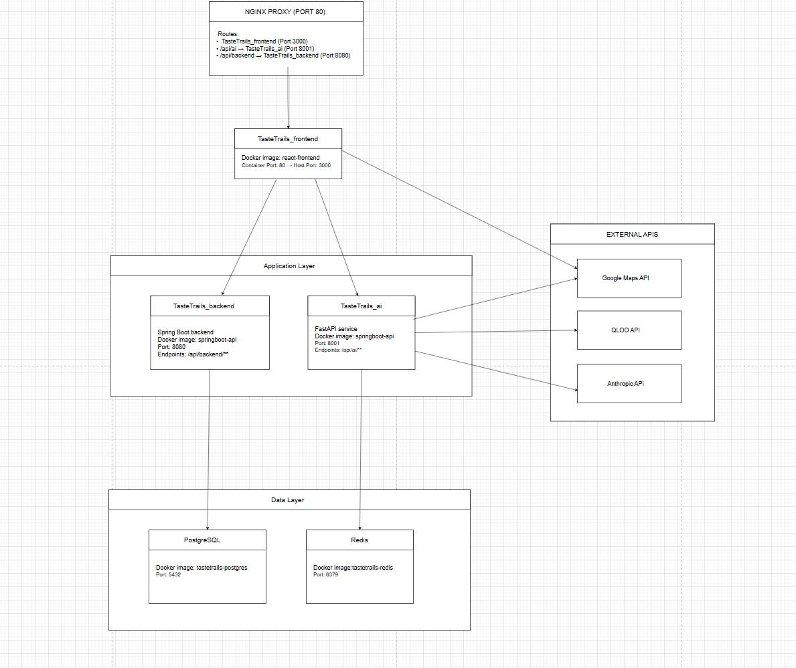
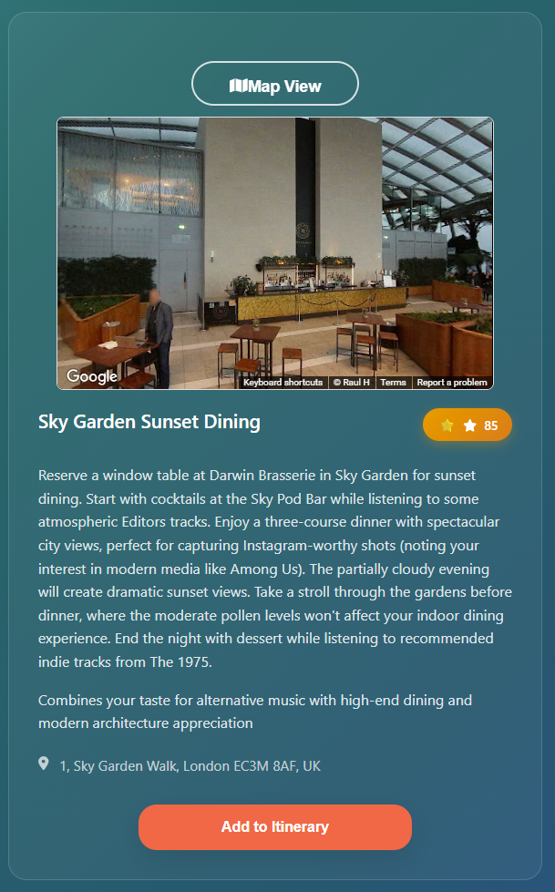
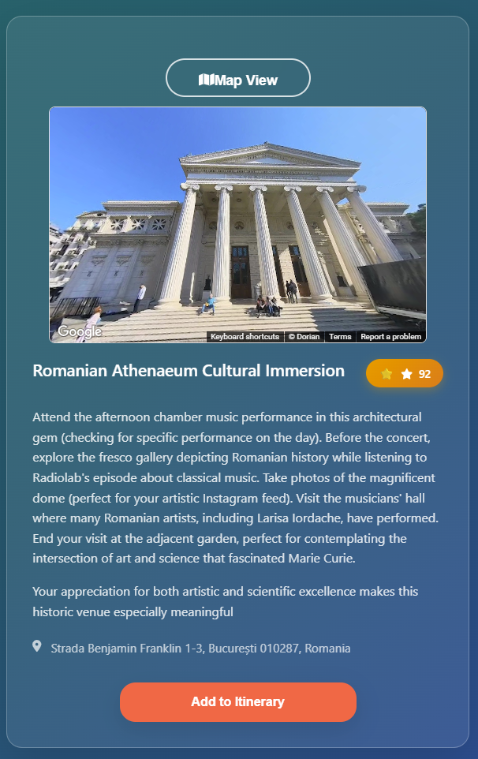

# TasteTrails

AI-Powered Cultural Intelligence Meets Smart Travel Planning.
Turn your favorite movies, actors, books, and brands into personalized travel experiences using Claude AI, Qloo's cultural intelligence, and real-time environmental data provided by Google Maps.


### Core Innovation

**Cultural Intelligence → Smart Recommendations → Perfect Experiences**

1. **Input your cultural DNA**: Favorite actors, movies, books, brands, video games, TV shows, podcasts, people
2. **AI analyzes connections**: Claude AI + Qloo's cultural graph finds deep patterns
3. **Smart itinerary creation**: Google Maps' Weather, air quality, pollen levels, and venue data optimize timing
4. **Personalized experiences**: Get recommendations that truly match your unique cultural fingerprint

---

##  Key Features

###  **Cultural Intelligence Engine**
- **Multi-domain preferences**: actors, movies, books, brands, video games, TV shows, podcasts, people
- **Qloo API integration**: World's most advanced cultural preference graph

### ️ **Smart Location Intelligence**
- **Google Maps integration**: Real-time venue data
- **Environmental awareness**: Weather, air quality, pollen levels
- **Optimal timing**: Best times to visit based on conditions and crowds

###  **Claude AI Integration**
- **Intelligent analysis**: Deep understanding of your cultural preferences
- **Contextual recommendations**: Considers weather, location, time, and personal taste
- **Natural language processing**: Explains why each recommendation fits your profile

---

## Architecture



### **External APIs Used**

**Cultural Intelligence:**
- **Qloo Taste AI™ API** - Cultural preference mapping and cross-domain recommendations
- **Anthropic Claude API** - Natural language processing and itinerary generation

**Google Maps Platform and Environmental Intelligence:**
- **Maps JavaScript API** - Interactive map rendering and visualization
- **Places API (New)** - Venue discovery and detailed place information
- **Geocoding API** - Location conversion and address processing
- **Weather API** - Real-time weather conditions and forecasts
- **Air Quality API** - Environmental health data for outdoor activity planning
- **Pollen API** - Allergy-aware recommendations and seasonal adjustments

### **Application Stack**
- **Frontend**: React 18 + Vite + Google Maps SDK
- **Backend**: Spring Boot (Java) - User management & business logic
- **AI Service**: FastAPI (Python) - AI integrations & recommendations
- **Database**: PostgreSQL + Redis caching
- **Infrastructure**: Docker + Docker Compose + Nginx

## API Endpoints
- For TasteTrails_ai(`/api/ai`)

### **Claude AI Service** (`/claude`)

| Endpoint | Method | Description |
|----------|---------|-------------|
| `/claude/test` | GET | Test Claude AI connection |
| `/claude/generate-options` | POST | Generate activity recommendations for specific time/location |
| `/claude/generate_options_today` | POST | Generate today's recommendations based on itinerary cities |


### **Qloo Cultural Intelligence** (`/qloo`)

| Endpoint                     | Method | Description |
|------------------------------|---------|-------------|
| `/search`                    | GET | Search for cultural entities by type and query |
| `/recommendations`           | POST | Get cultural recommendations based on user preferences |
| `/recommendation-cities` | POST | Get city recommendations based on itinerary cities |

### **Google Maps & Environmental Data** (`/google-maps`)

| Endpoint | Method | Description                                                                      |
|----------|---------|----------------------------------------------------------------------------------|
| `/venues` | POST | Find venues near specific coordinates                                            |
| `/routes` | POST | Calculate routes between two addresses (not used right now, maybe in the future) |
| `/geocode-route` | POST | Convert address to coordinates                                                   |
| `/weather-route` | POST | Get weather forecast for location                                                |
| `/air-quality` | POST | Get hourly air quality data                                                      |
| `/pollen-forecast` | POST | Get pollen forecast for location                                                 |
| `/is-city` | POST | Validate if location is a city                                                   |

## Live Deployment

**Access TasteTrails**: [tastetrails.edjitareanu.ro](https://tastetrails.edjitareanu.ro/)

Deployed on **DigitalOcean Droplet** with production-ready infrastructure:
- **Cloud Platform**: DigitalOcean VM
- **Domain**: Custom subdomain with SSL
- **Environment**: Production Docker containers
- **Monitoring**: Health checks and logging enabled

---

##  Local Deployment

### Prerequisites
```bash
Docker Desktop 4.0+
Docker Compose 2.0+
Git 2.30+

# Required API Keys
Google Maps Platform API key
Qloo Taste AI™ API key  
Anthropic Claude API key

# Clone the repository
git clone https://github.com/Eduardismund/tastetrails.git
cd tastetrails

# Create environment file
touch .env

# Add your API keys to .env:
echo "ANTHROPIC_API_KEY=your_anthropic_key" >> .env
echo "QLOO_API_KEY=your_qloo_key" >> .env  
echo "GOOGLE_MAPS_API_KEY=your_google_maps_key" >> .env
echo "POSTGRES_DB=tastetrails" >> .env
echo "POSTGRES_USER=tastetrails_user" >> .env
echo "POSTGRES_PASSWORD=tastetrails_pass" >> .env
echo "REDIS_PASSWORD=redispass" >> .env


# Launch everything
docker-compose up -d

# Access the app
open http://localhost

```

##  Demo Video

![TasteTrails Demo]

**Watch the demo video**: [YouTube Link](https://youtube.com/watch?v=YOUR_VIDEO_ID)

---

## More Examples 


