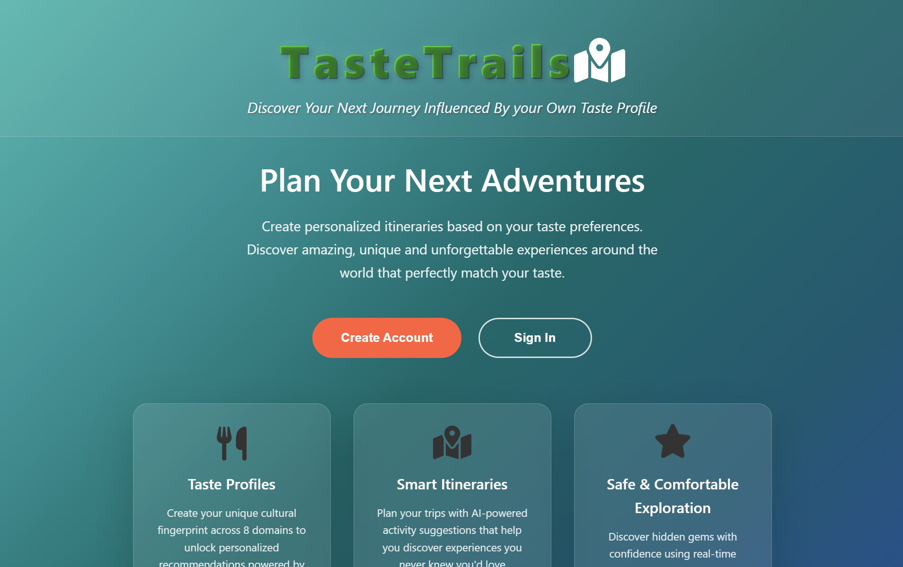

# TasteTrails


AI-Powered Cultural Intelligence Meets Smart Travel Planning.
Turn your favorite movies, actors, books, and brands into personalized travel experiences using Claude AI, Qloo's cultural intelligence, and real-time environmental data provided by Google Maps.

---

## Core Innovation

**Cultural Intelligence → Smart Recommendations**

1. **Input your cultural DNA**: Favorite actors, movies, books, brands, video games, TV shows, podcasts, people
2. **AI analyzes connections**: Claude AI + Qloo's cultural graph finds deep patterns
3. **Smart itinerary creation**: Google Maps' Weather, air quality, pollen levels, and venue data optimize timing
4. **Personalized experiences**: Get recommendations that truly match your unique cultural fingerprint

---

## How It Works

### **Step-by-Step User Experience**

1. **Cultural Profile Setup**
    - Input preferences across 8 domains (movies, actors, books, brands, games, shows, podcasts, people)
    - AI analyzes your unique cultural DNA using Claude + Qloo

2. **Location & Time Selection**
    - Choose your city or travel destination
    - Set available time slots for activities

3. **Smart Activity Generation**
    - Get **3 unique options** for each time slot
    - Each option considers weather, air quality, pollen levels, and cultural fit
    - **Exclusion system**: Previously selected activities won't be recommended again

4. **Personalized Selection & Learning**
    - Choose your preferred activity from 3 AI-generated options

---

##  Key Features

###  **Cultural Intelligence Engine**
- **Multi-domain preferences**: Comprehensive analysis across 8 cultural domains - actors, movies, books, brands, video games, TV shows, podcasts, and influential people
- **Qloo API integration**: Leverages the world's most advanced cultural preference graph to provide sophisticated recommendations based on user input preferences. Qloo's platform goes beyond simple matching by classifying cultural data into nuanced genres and behavioral patterns, revealing deep insights about a person's taste profile and cultural sophistication level - information that Claude AI then uses for contextual analysis and personalized recommendation generation

### ️ **Smart Location Intelligence**
- **Google Maps integration**: Comprehensive real-time venue discovery and detailed place information based on the user's itinerary location
- **Environmental awareness**: Advanced environmental intelligence where weather conditions, air quality index, and pollen levels are meticulously analyzed and taken into account by Claude AI during the recommendation evaluation process, ensuring optimal activity timing and user comfort
- **Intelligent venue filtering**: Automatically adjusts recommendations based on environmental factors - suggesting indoor cultural venues during poor air quality days or outdoor markets when conditions are perfect

###  **Claude AI Integration**
- **Intelligent cultural analysis**: Deep semantic understanding of your cultural preferences, personality traits, and lifestyle patterns extracted from your multi-domain inputs
- **Contextual recommendations**: Sophisticated decision-making that simultaneously considers weather conditions, location characteristics, time constraints, personal taste profile, and real-time environmental data to generate perfectly timed activity suggestions
- **Natural language processing**: Provides detailed, human-readable explanations for why each recommendation aligns with your cultural DNA, creating transparency in the AI decision-making process

---


### **External APIs Used**

**Cultural Intelligence:**
- **Qloo Taste AI™ API** - Cultural preference mapping and cross-domain recommendations
- **Anthropic Claude API** - Natural language processing and itinerary generation

**Google Maps Platform and Environmental Intelligence:**
- **Maps JavaScript API** - Interactive map rendering and visualization
- **Places API (New)** - Venue discovery and detailed place information
- **Geocoding API** - Location conversion and address processing
- **Weather API** - Real-time weather conditions and forecasts
- **Air Quality API** - Environmental health data for outdoor activity planning
- **Pollen API** - Allergy-aware recommendations and seasonal adjustments

### **Application Stack**
- **Frontend**: React 18 + Vite + Google Maps SDK
- **Backend**: Spring Boot (Java) - User management & business logic
- **AI Service**: FastAPI (Python) - AI integrations & recommendations
- **Database**: PostgreSQL + Redis caching
- **Infrastructure**: Docker + Docker Compose + Nginx


---

## Microservices Architecture


## **Backend Architecture**
### **Entity Models**
- **User**: Core authentication and profile management with email/password system
- **Itinerary**: Multi-day travel plans with geographic bounds and activity scheduling
- **Activity**: AI-generated experiences with cultural reasoning and environmental context
- **TasteProfile**: 8-domain cultural preference storage (movies, actors, books, brands, games, shows, podcasts, people)
- **ThematicType**: Activity categorization enum (Cultural Activity,Social Activity, Culinary Activity)

### **Authentication & User Management**
- **User registration & login**: Complete user lifecycle management
- **Profile management**: User settings and preference storage

### **Data Persistence & Management**
- **PostgreSQL integration**: Robust relational data storage
- **JPA/Hibernate ORM**: Object-relational mapping for clean data access
- **Repository pattern**: Separation of data access logic
- **Entity relationships**: Complex mappings between users, itineraries, activities, and taste profiles

### API Endpoints (`/api/backend`)
#### **Activity Management** (`/itineraries/{itineraryId}/activities`)

| Endpoint | Method | Description                            |
|----------|---------|----------------------------------------|
| `/{itineraryId}/activities` | POST | Add new activity to specific itinerary |
| `/{itineraryId}/activities` | GET | Get all activities for an itinerary    |
| `/{itineraryId}/activities/{activityId}` | GET | Get specific activity details          |
| `/{itineraryId}/activities/{activityId}` | PUT | Update existing activity (unused)      |


#### **Itinerary Management** (`/itineraries`)

| Endpoint | Method | Description                           |
|----------|---------|---------------------------------------|
| `/users/{userId}` | POST | Create new itinerary for user         |
| `/{itineraryId}` | GET | Get specific itinerary details        |
| `/users/{userId}` | GET | Get all user itineraries              |
| `/users/{userId}/destinations` | GET | Get all destinations user has visited |
| `/users/{userId}/upcoming` | GET | Get upcoming itineraries for user (unused)     |
| `/users/{userId}/count` | GET | Get total itinerary count for user (unused)    |
| `/{itineraryId}` | DELETE | Delete specific itinerary (unused)    |

#### **Cultural Profile Management** (`/taste-profiles`)

| Endpoint | Method | Description |
|----------|---------|-------------|
| `/users/{userId}` | POST | Create or update user's cultural preferences |
| `/users/{userId}` | GET | Get user's complete taste profile |
| `/users/{userId}/exists` | GET | Check if user has a taste profile (unused) |

#### **User Management** (`/users`)

| Endpoint | Method | Description |
|----------|---------|-------------|
| `/` | POST | Register new user account |
| `/{userId}` | GET | Get user profile details |
| `/login` | POST | Authenticate user and return session |
| `/` | GET | Get all users |
| `/check-email` | GET | Verify email availability during registration (unused)|
| `/count` | GET | Get total user count (analytics) (unused)|
| `/{userId}` | DELETE | Delete user account (unused)|

## **FastAPI AI Architecture**

### **AI Service Responsibilities**
- **Cultural Intelligence Processing**: Claude AI integration for preference analysis
- **External API Orchestration**: Google Maps, Qloo, and environmental data coordination
- **Recommendation Generation**: 3-option activity creation with cultural reasoning
- **Environmental Intelligence**: Weather, air quality, and pollen data processing
- **Smart Caching**: Redis integration for optimal API performance

### **Redis Caching Strategy**
- **Cache Keys**: Dynamic generation based on request parameters
- **TTL Management**: 1-hour cache for most endpoints, 24-hour for daily recommendations
- **Cache-First Architecture**: Always check cache before external API calls
- **Performance Optimization**: Reduces API costs and improves response times
- **Distributed Caching**: Redis cluster-ready for horizontal scaling

### **Service Integration Pattern**
- **Claude AI**: Cultural preference analysis and natural language generation
- **Qloo API**: Cultural intelligence and cross-domain recommendations
- **Google Maps**: Venue discovery, geocoding, and environmental data
- **Redis**: Intelligent caching layer for all external API responses

### API Endpoints

#### **Claude AI Service** (`/claude`)

| Endpoint | Method | Description |
|----------|---------|-------------|
| `/claude/test` | GET | Test Claude AI connection |
| `/claude/generate-options` | POST | Generate activity recommendations for specific time/location |
| `/claude/generate_options_today` | POST | Generate today's recommendations based on itinerary cities |


#### **Qloo Cultural Intelligence** (`/qloo`)

| Endpoint                     | Method | Description |
|------------------------------|---------|-------------|
| `/search`                    | GET | Search for cultural entities by type and query |
| `/recommendations`           | POST | Get cultural recommendations based on user preferences |
| `/recommendation-cities` | POST | Get city recommendations based on itinerary cities |

#### **Google Maps & Environmental Data** (`/google-maps`)

| Endpoint | Method | Description                                                                      |
|----------|---------|----------------------------------------------------------------------------------|
| `/venues` | POST | Find venues near specific coordinates                                            |
| `/routes` | POST | Calculate routes between two addresses (not used right now, maybe in the future) |
| `/geocode-route` | POST | Convert address to coordinates                                                   |
| `/weather-route` | POST | Get weather forecast for location                                                |
| `/air-quality` | POST | Get hourly air quality data                                                      |
| `/pollen-forecast` | POST | Get pollen forecast for location                                                 |
| `/is-city` | POST | Validate if location is a city                                                   |

---

## Live Deployment

**Access TasteTrails**: [tastetrails.edjitareanu.ro](https://tastetrails.edjitareanu.ro/)

Deployed on **DigitalOcean Droplet** with production-ready infrastructure:
- **Cloud Platform**: DigitalOcean VM
- **Domain**: Custom subdomain with SSL
- **Environment**: Production Docker containers
- **Monitoring**: Health checks and logging enabled

---

##  Local Deployment

### Prerequisites
```bash
Docker Desktop 4.0+
Docker Compose 2.0+
Git 2.30+

# Required API Keys
Google Maps Platform API key
Qloo Taste AI™ API key  
Anthropic Claude API key

# Clone the repository
git clone https://github.com/Eduardismund/tastetrails.git
cd tastetrails

# Create environment file
touch .env

# Add your API keys to .env:
echo "ANTHROPIC_API_KEY=your_anthropic_key" >> .env
echo "QLOO_API_KEY=your_qloo_key" >> .env  
echo "GOOGLE_MAPS_API_KEY=your_google_maps_key" >> .env
echo "POSTGRES_DB=tastetrails" >> .env
echo "POSTGRES_USER=tastetrails_user" >> .env
echo "POSTGRES_PASSWORD=tastetrails_pass" >> .env
echo "REDIS_PASSWORD=redispass" >> .env


# Launch everything
docker-compose up -d

# Access the app
open http://localhost

```
--- 
##  Demo Video

![TasteTrails Demo]

**Watch the demo video**: [YouTube Link](https://youtube.com/watch?v=YOUR_VIDEO_ID)
